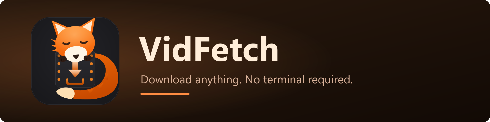

<p align="center">
  
</p>

<p align="center">
  <a href="../../releases/latest"></a>
  <a href="../../releases"></a>
  <a href="../../actions/workflows/release.yml"></a>
  
</p>

<p align="center">
  
  
  
  
  
</p>

# VidFetch

A sleek, cross-platform desktop GUI for [yt-dlp](https://github.com/yt-dlp/yt-dlp) — paste a URL, pick a format, download. No terminal required.

Built with Tauri v2 + Svelte 5 + TypeScript. Rust handles the download pipeline; the UI is plain CSS with full theme control.

> **Status:** `1.0` — stable core feature set. Builds are not yet code-signed (see install notes below).

---

## Why

The yt-dlp CLI is the best video downloader on the internet, but "best" and "friendly" aren't always the same thing. VidFetch is a thin, pretty layer on top — you get yt-dlp's full extractor support, but the UX looks and feels like a real desktop app instead of a man page.

It also **manages yt-dlp for you**: on first launch it downloads the latest yt-dlp and a matching ffmpeg build into its own app-data folder, and updates them on demand from Settings. Nothing to install, nothing to `pip`.

## Features

- **Paste-and-download** — single videos, playlists (with per-item selection), or audio-only
- **Download queue** — concurrency limit, pause / resume / cancel, scheduler
- **Format control** — resolution/codec/quality picker, output container choice (mp4 / mkv / webm)
- **Subtitles** — multi-language download and embedding
- **Embedding** — thumbnail, metadata, and chapters baked into the output file
- **SponsorBlock** — skip or remove sponsored segments
- **Cookies** — import from your browser or a `cookies.txt` for member/age-gated content
- **Power options** — rate limit, retries, custom output template, download archive (skip already-downloaded)
- **History** — past downloads with re-download and open-folder shortcuts
- **Presets** — save your favorite option combos
- **Raw log panel** — full yt-dlp output per job for debugging
- **Error recovery** — actionable error messages with one-click retry
- **Themes** — dark, light, and fox 🦊, system-preference aware
- **Self-maintaining** — first-run wizard fetches yt-dlp + ffmpeg; in-app auto-update for VidFetch itself
- **Native installers** — Windows (NSIS), macOS (`.dmg`), Linux (AppImage + `.deb`)

### Post-1.0

- [ ] Code signing (Windows + macOS notarization) — [it costs money](https://learn.microsoft.com/en-us/azure/trusted-signing/)

## Install

> **Nightly builds:** want to test upcoming features (like the v2 GIF/editing work) before they're released? Switch **Settings → Update channel → Nightly** in the app. Stable is the default and never receives pre-release builds.

### Windows

Grab the latest `VidFetch_x.y.z_x64-setup.exe` from the [Releases page](../../releases) and run it. The installer is not yet code-signed, so SmartScreen will show a warning on first run — click **More info → Run anyway**.

On first launch, the app's setup wizard downloads yt-dlp (~5 MB) and ffmpeg (~100 MB) from their official sources. Everything lives in `%APPDATA%\be.mystic.vidfetch\`; no files touched outside that folder and your chosen download directory.

### macOS

Grab the universal `.dmg` (runs natively on Apple Silicon and Intel) from the [Releases page](../../releases) — ships from `v1.0.0`. The app is not yet signed or notarized, so on first launch right-click the app → **Open** (or clear the quarantine flag with `xattr -d com.apple.quarantine /Applications/VidFetch.app`). App data lives in `~/Library/Application Support/be.mystic.vidfetch/`.

### Linux

Grab the `.AppImage` (portable) or `.deb` (Debian/Ubuntu) from the [Releases page](../../releases) — ships from `v1.0.0`. App data lives in `~/.local/share/be.mystic.vidfetch/`. Note: in-app auto-update only works for the AppImage; `.deb` installs update through your package manager or a manual download.

## Build from source

You need:

- [Node.js](https://nodejs.org/) 20+
- [Rust](https://www.rust-lang.org/tools/install) stable (1.77+)
- The [Tauri v2 system prerequisites](https://v2.tauri.app/start/prerequisites/) for your OS (WebView2 on Windows — usually already installed on Windows 11)

```bash
git clone https://github.com/YliasR/VidFetch.git
cd VidFetch
npm install
npm run tauri dev     # hot-reload dev build
npm run tauri build   # release build + platform installer in src-tauri/target/release/bundle/
```

### Branding assets

Icon and installer artwork are generated from the SVG sources in `branding/`:

```bash
npm run tauri icon -- branding/icon.svg   # regenerate the full app icon set
pip install resvg-py pillow
python branding/build.py                  # regenerate NSIS bitmaps + README banner
```

## Project layout

```
VidFetch/
├── src/                  # Svelte frontend (TS)
│   ├── lib/components/   # UI components
│   ├── lib/stores/       # reactive state
│   ├── lib/ipc.ts        # typed wrappers around Tauri invoke()
│   └── styles/           # base + theme-{dark,light,fox}.css
├── src-tauri/            # Rust backend
│   └── src/
│       ├── commands/     # #[tauri::command] handlers
│       ├── ytdlp/        # installer + runner + arg builder
│       ├── paths.rs      # app data / bin dir resolution
│       └── state.rs      # shared app state
├── branding/             # SVG sources + build script for icon/banner art
└── scripts/              # dev/build helper scripts
```

## Tech stack

| Layer         | Choice                                    | Why                                                                 |
| ------------- | ----------------------------------------- | ------------------------------------------------------------------- |
| Shell         | [Tauri v2](https://v2.tauri.app/)         | Small installers, Rust backend, uses the system webview             |
| Frontend      | [Svelte 5](https://svelte.dev/) + TS      | Minimal runtime, clean syntax, no unnecessary state lib             |
| Styling       | Plain CSS + custom properties             | Maximum theme flexibility, no framework churn                       |
| Downloader    | [yt-dlp](https://github.com/yt-dlp/yt-dlp)| Best-in-class extractor coverage                                    |
| Postprocessor | [ffmpeg](https://ffmpeg.org/) (BtbN build)| Required for merging, audio extraction, and metadata/thumb embedding|
| Packaging     | NSIS / dmg / AppImage / deb (Tauri bundler)| Native installer per platform from one config                      |

## Credits

VidFetch is a GUI — all the heavy lifting is done by upstream projects:

- **[yt-dlp](https://github.com/yt-dlp/yt-dlp)** — the actual downloader. None of this works without it.
- **[ffmpeg](https://ffmpeg.org/)** — format conversion and stream muxing. Windows/Linux builds by [BtbN](https://github.com/BtbN/FFmpeg-Builds), macOS builds by [Martin Riedl](https://ffmpeg.martin-riedl.de/).
- **[Tauri](https://v2.tauri.app/)** — the app shell framework.
- **[Svelte](https://svelte.dev/)** — the frontend framework.

## License

TBD — will be set before the first tagged release. Contributions welcome once the license is clarified.

---

<sub>Built with ❤️ </sub>
